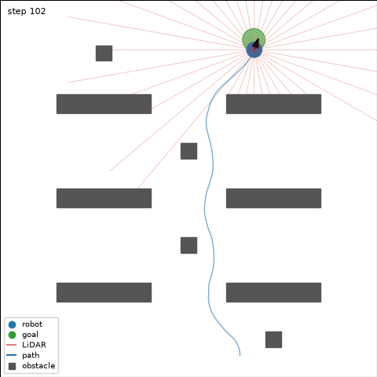
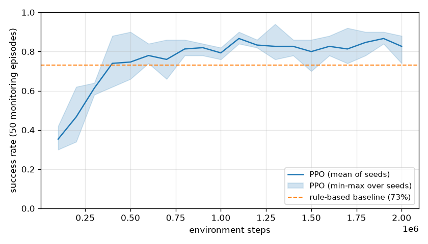
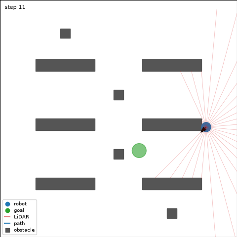

# robotsim

[](https://github.com/eranaydogan/robotsim/actions/workflows/ci.yml)

C++17 mobile robot navigation environment with a Gymnasium-compatible Python interface,
and a PPO agent trained in it.

**Status:** Phase 3 complete (first trained agent). See the [project plan](docs/PROJECT_PLAN.md).



## Results

PPO trained for 2,000,000 environment steps, evaluated over 1,000 episodes on seeds that were
never used for training, with deterministic actions:

| Policy | Success | Collision | Timeout | Mean length |
|---|---|---|---|---|
| Random | 0.3% | 99.7% | 0.0% | 37.8 |
| Rule-based controller | 73.1% | 22.4% | 4.5% | 173.4 |
| **PPO (3 seeds)** | **87.6% ± 3.7%** | **5.6% ± 3.5%** | 6.9% ± 1.4% | 101.5 |



The agent beats the tuned rule-based controller on both metrics and reaches the goal in
roughly half as many steps. Collision rate varies more across seeds (2.0% to 9.0%) than
success rate, so safety is the less stable of the two. A typical remaining failure is a
start pose close to a wall with the goal behind the robot:



Training takes 3.1 minutes per run on an Intel Core i9-13900HX (10,700 environment steps
per second, 8 parallel environments, CPU only).
Full report: [docs/results/phase3_training.md](docs/results/phase3_training.md).

## Simulation core

- Differential-drive robot with exact unicycle integration
- Circle-versus-box collision checking against shelves, pillars and walls
- 36-beam raycast LiDAR and a normalized 40-element observation
- Progress-based reward with goal bonus and collision penalty
- Portable xoshiro256** random number generator; bit-for-bit deterministic for a given binary

| Layer | Steps per second | Per step |
|---|---|---|
| C++ core, step + observation | 518,803 | 1.93 us |
| `World.step` through the bindings | 1,211,751 | 0.83 us |
| `World.step` + `observation` | 327,426 | 3.05 us |
| `RobotNavEnv.step` | 133,959 | 7.47 us |

The simulation itself costs about a microsecond per step; the Python layers add roughly six
more, mostly one NumPy allocation per observation and the Gymnasium bookkeeping. Amortizing
that cost over many environments is the subject of Phase 4.
Full reports: [C++ core](docs/results/phase1_speed.md), [Python interface](docs/results/phase2_speed.md).

## Usage

``````python
import gymnasium as gym
import robotsim  # registers RobotNav-v0
from robotsim.sb3 import SB3Policy, load_ppo
from robotsim.evaluate import evaluate

env = gym.make("RobotNav-v0")
obs, info = env.reset(seed=0)
obs, reward, terminated, truncated, info = env.step(env.action_space.sample())

# Reproduce the reported numbers with the committed model
result = evaluate(SB3Policy(load_ppo("models/ppo-s0.zip")), episodes=1000)
print(result.success_rate, result.collision_rate)
``````

- Passes `gymnasium.utils.env_checker.check_env` with warnings treated as errors, render check included
- One seed reproduces the whole sequence of episodes, not just the first one
- Environment parameters are defined once in C++ and exposed as `robotsim.Config`
- `render_mode="rgb_array"` draws obstacles, LiDAR beams, the path and the goal

## Requirements

- Windows 10/11 x64
- Visual Studio 2022 with the *Desktop development with C++* workload
- Python 3.12 (64-bit)

## Build, test, train

``````powershell
py -3.12 -m venv .venv
.\.venv\Scripts\Activate.ps1
python -m pip install scikit-build-core pybind11 cmake numpy gymnasium pytest matplotlib
python -m pip install torch --index-url https://download.pytorch.org/whl/cpu
python -m pip install stable-baselines3 tensorboard

# C++ unit tests
cmake -S . -B build/tests -DBUILD_TESTING=ON
cmake --build build/tests --config Release
ctest --test-dir build/tests -C Release --output-on-failure

# Python package (editable) and tests
python -m pip install -e . --no-build-isolation
python -m pytest

# Benchmarks
.\scripts\run_cpp_benchmark.ps1
python scripts\benchmark_env.py

# Training and evaluation
python scripts\evaluate_baselines.py
python scripts\train.py --seed 0 --name ppo-s0
python scripts\collect_results.py --runs ppo-s0 --plot docs/results/phase3_learning_curve.png
python scripts\render_episode.py --model models/ppo-s0.zip --output episode.gif
``````

After changing C++ code, rerun the ``pip install`` command to rebuild the module.

## Documentation

- [Project plan](docs/PROJECT_PLAN.md)
- [Design decisions](docs/DECISIONS.md)