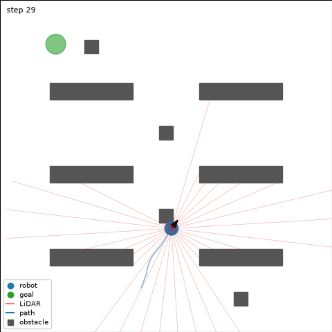

# robotsim

[](https://github.com/eranaydogan/robotsim/actions/workflows/ci.yml)

C++17 mobile robot navigation environment with a Gymnasium-compatible Python interface.

**Status:** Phase 2 complete (Gymnasium interface). See the [project plan](docs/PROJECT_PLAN.md).



## Simulation core

- Differential-drive robot with exact unicycle integration
- Circle-versus-box collision checking against shelves, pillars and walls
- 36-beam raycast LiDAR and a normalized 40-element observation
- Progress-based reward with goal bonus and collision penalty
- Portable xoshiro256** random number generator; bit-for-bit deterministic for a given binary

## Python interface

``````python
import gymnasium as gym
import robotsim  # registers RobotNav-v0

env = gym.make("RobotNav-v0")
obs, info = env.reset(seed=0)
obs, reward, terminated, truncated, info = env.step(env.action_space.sample())
``````

- Passes `gymnasium.utils.env_checker.check_env` with warnings treated as errors, render check included
- One seed reproduces the whole sequence of episodes, not just the first one
- Environment parameters are defined once in C++ and exposed as `robotsim.Config`
- `render_mode="rgb_array"` draws obstacles, LiDAR beams, the path and the goal

## Results

Single thread pinned to one performance core, Intel Core i9-13900HX, MSVC 19.44, Release build:

| Layer | Steps per second | Per step |
|---|---|---|
| C++ core, step + observation | 518,803 | 1.93 us |
| `World.step` through the bindings | 1,211,751 | 0.83 us |
| `World.step` + `observation` | 327,426 | 3.05 us |
| `RobotNavEnv.step` | 133,959 | 7.47 us |

The simulation itself costs about a microsecond per step; the Python layers add
roughly six more, mostly one NumPy allocation per observation and the Gymnasium
bookkeeping. Amortizing that cost over many environments is the subject of Phase 4.

Full reports: [C++ core](docs/results/phase1_speed.md), [Python interface](docs/results/phase2_speed.md).

## Requirements

- Windows 10/11 x64
- Visual Studio 2022 with the *Desktop development with C++* workload
- Python 3.12 (64-bit)

## Build and test

``````powershell
py -3.12 -m venv .venv
.\.venv\Scripts\Activate.ps1
python -m pip install scikit-build-core pybind11 cmake numpy gymnasium pytest matplotlib

# C++ unit tests
cmake -S . -B build/tests -DBUILD_TESTING=ON
cmake --build build/tests --config Release
ctest --test-dir build/tests -C Release --output-on-failure

# Python package (editable) and tests
python -m pip install -e . --no-build-isolation
python -m pytest

# Benchmarks
.\scripts\run_cpp_benchmark.ps1
python scripts\benchmark_env.py
``````

After changing C++ code, rerun the ``pip install`` command to rebuild the module.

## Documentation

- [Project plan](docs/PROJECT_PLAN.md)
- [Design decisions](docs/DECISIONS.md)